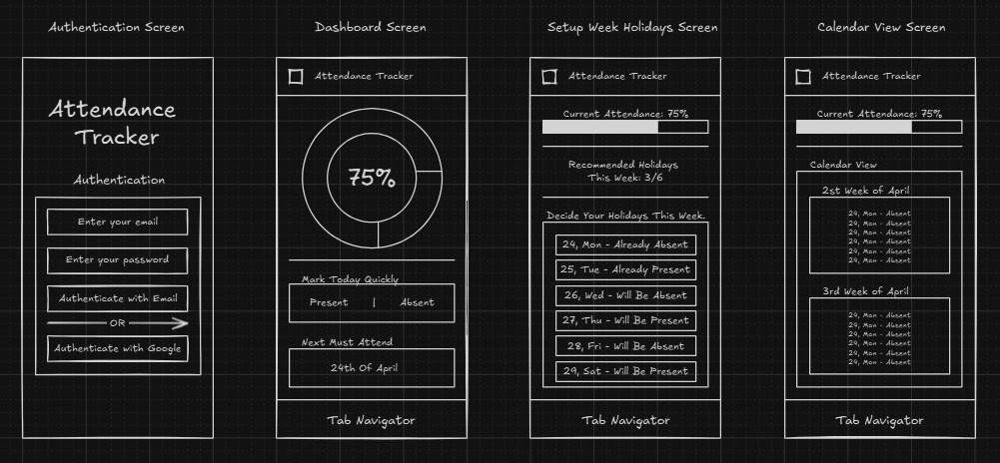

# Hey there! 👋 Welcome to Attendance Tracker

Attendance Tracker is your go-to buddy for keeping tabs on your attendance without breaking a sweat. Inspired by the classic 75% attendance rule (you know the one!), this tool helps you stay on top of your attendance game. Whether you're a student or just someone trying to keep things in check, this has got you covered with features like tracking attendance, managing holidays, and even figuring out how many days you can skip without getting into trouble. 

> **Heads up**: This ain't for dummies 🤓

## What’s Cool About It?

- Keep your attendance percentage in check without the hassle.
- Set up your weekly holidays just the way you like.
- Plan your breaks without messing up your attendance goals.
- Super simple and easy-to-use interface.

## Sneak Peek

Here’s a quick look at what it’s all about:

## How to Get Started

1. **Grab the App**  
    Head over to the [Releases](#) section to snag the latest version.  
    *P.S. If you don’t see any releases, it’s still in the works!*

2. **Install It**  
    Find the file you downloaded, open it up, and follow the steps to get started.

## Got Questions?

Ping me on Discord: **mastercuber55**  
I’m always around to help or just chat about cool stuff.

Stay awesome and keep tracking! 🚀